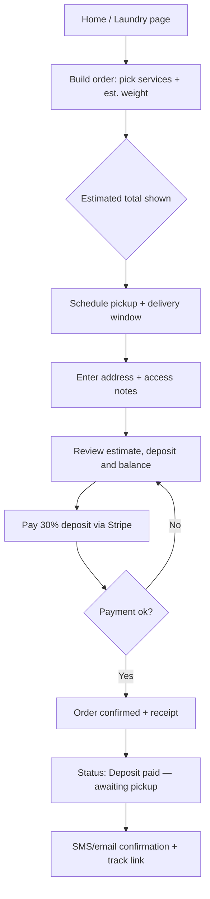
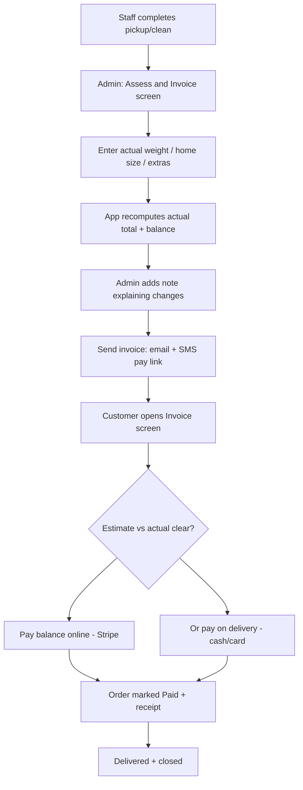
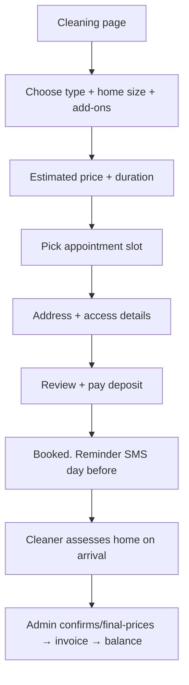
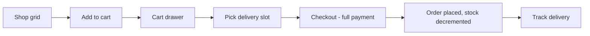
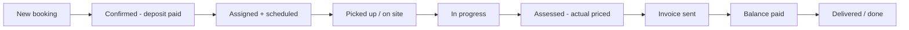
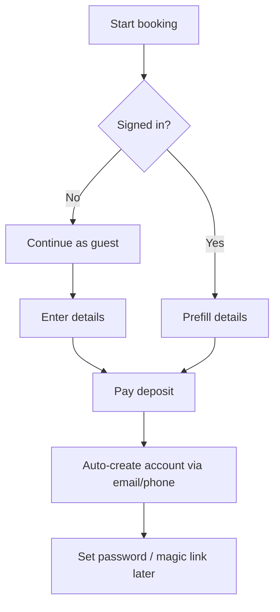

# Brilliance Care — Website Blueprint

**Laundry & Cleaning Services · Australia (AUD) · Mobile‑first**

*Version 1.0 — planning document. Companion file: `wireframes.html` (clickable mobile prototype).*

---

## 0. How to read this blueprint

This document is the full plan for turning the current partial build into a polished, mobile‑first web app for both customers and admins. It is organised so you can act on it top‑to‑bottom:

1. **Design principles** — the rules every screen follows.
2. **The signature flow** — the estimate → deposit → invoice → balance model that makes this business work. Read this first; it shapes everything else.
3. **Information architecture** — sitemap and the mobile navigation model.
4. **Page‑by‑page specs** — client, then admin, each tagged `KEEP` / `CHANGE` / `ADD`.
5. **User‑flow diagrams** — the key journeys as diagrams.
6. **Design system & components** — colours, type, spacing, reusable parts.
7. **Data model & tech** — what the backend needs.
8. **Keep / change / add summary + phased roadmap** — what to do, in what order.

Every screen referenced here is drawn in the companion `wireframes.html` prototype.

---

## 1. Design principles

These are non‑negotiable rules for the whole product. When a design decision is unclear, fall back to these.

**1. Phone‑first, always.** Most visitors are on a phone. Design every screen at 390 px wide first, then let it grow. One primary action per screen, thumb‑reachable. A fixed bottom tab bar for the main sections. No hover‑only interactions.

**2. One clear next step.** Every screen has a single obvious primary button (brand gradient). Secondary actions are quieter. Never make the user hunt for what to do next.

**3. Honesty about price.** Because prices are *estimates*, the UI must say so plainly and consistently, and explain the deposit + final‑invoice model before the customer pays. Trust is the product.

**4. Show, don't make them think.** Progress bars on multi‑step flows, status timelines on orders, plain‑language labels ("Pickup Tomorrow, 9–11am") over codes. Empty states that teach.

**5. Fast and forgiving.** Skeleton loaders, optimistic UI, undo on destructive actions, inline validation with helpful messages. Works on a slow 4G connection.

**6. Accessible by default.** WCAG AA contrast, 44×44 px minimum tap targets, real focus states, labelled icons, respects reduced‑motion.

**7. Consistent, calm visual language.** One blue→cyan brand gradient, generous white space, rounded‑2xl cards, soft shadows. It should feel clean — like the service.

---

## 2. The signature flow — estimate, deposit, service, invoice, balance

This is the heart of the business and the thing the current build does **not** yet handle. Laundry loads get mis‑estimated, customers add extra services, and cleaning prices depend on the real size and state of a home. So prices shown online are **estimates**, and money is collected in two stages.

### The five stages

| Stage | What happens | Who | Money |
|---|---|---|---|
| **1. Estimate** | Customer builds an order (laundry items/loads, cleaning type + home size, or products). The app shows an **Estimated total**, clearly labelled. | Customer | — |
| **2. Deposit** | At checkout the customer pays a **deposit — a % of the estimate** (recommend 30%) to confirm the booking. Balance shown as "due after service". | Customer | Deposit paid (card, Stripe) |
| **3. Service** | Pickup / cleaning happens. Staff record the **actual** load weight, home size, and any extra services. | Staff/Admin | — |
| **4. Invoice** | The app recomputes the **actual total**, admin reviews and sends an **invoice** showing estimate vs actual, line by line, and the remaining **balance**. | Admin | — |
| **5. Balance** | Customer pays the balance — online via the invoice link, or on delivery (cash/card). Order closes as **Paid**. | Customer | Balance paid |

### Why this matters for the UI

- The word **"Estimated"** appears next to every price the customer sees before service, with a short "Why estimated?" explainer.
- Checkout clearly separates **Deposit now** from **Balance later**.
- After service, the customer gets a **notification + invoice screen** showing exactly what changed and why (e.g. "Estimated 8 kg → actual 10.4 kg", "Added: ironing ×5").
- The admin needs a dedicated **"Assess & Invoice"** screen to turn a completed job into a final bill in under a minute.

This flow is drawn end‑to‑end in §5 (diagrams) and prototyped in `wireframes.html`.

### Australia specifics

- **Currency:** AUD, shown as `$` with `A$` where ambiguity matters. Two decimals.
- **GST:** Prices displayed **GST‑inclusive** (standard for AU consumer pricing); invoices show the 10% GST component as a line. If the business isn't GST‑registered yet, hide the GST line via a settings flag.
- **Payments:** **Stripe** (native AUD, supports deposit now + balance later cleanly via separate PaymentIntents or an invoice). Apple Pay / Google Pay on mobile for one‑tap deposits.
- **Address & area:** suburb + state + 4‑digit postcode; a **"Do we service your area?"** postcode check before booking.
- **Phone:** `+61` format, mobile‑first for SMS status updates.

---

## 3. Information architecture

### 3.1 Sitemap

```
Brilliance Care
├── Home                         (/)                     public
├── Services
│   ├── Laundry                  (/laundry)              public → book
│   ├── Cleaning                 (/cleaning)             public → book
│   └── Shop / Products          (/shop)                 public → buy
├── Book / Order flow
│   ├── Build order / estimate   (/book/:service)        public (guest ok)
│   ├── Schedule pickup/slot     (step)                  "
│   ├── Address & details        (step)                  "
│   ├── Review estimate          (step)                  "
│   └── Deposit checkout         (/checkout)             "
├── My Account                   (/account)              auth
│   ├── Orders & bookings        (/account/orders)       auth
│   ├── Order detail + tracking  (/account/orders/:id)   auth
│   ├── Invoices + pay balance   (/account/invoices/:id) auth
│   ├── Addresses                (/account/addresses)    auth
│   └── Profile & settings       (/account/profile)      auth
├── Support
│   ├── How it works             (/how-it-works)         public
│   ├── Pricing                  (/pricing)              public
│   ├── Contact                  (/contact)              public
│   └── FAQ                      (/faq)                  public
├── Auth                         (/login /register)      public
└── Admin                        (/admin/*)              admin only
    ├── Dashboard                (/admin)
    ├── Orders & bookings        (/admin/orders)
    ├── Assess & Invoice         (/admin/orders/:id)
    ├── Schedule / calendar      (/admin/schedule)
    ├── Services & pricing       (/admin/services)
    ├── Products / inventory     (/admin/products)
    ├── Customers                (/admin/customers)
    └── Settings                 (/admin/settings)
```

### 3.2 Navigation model (mobile)

**Bottom tab bar** — the primary navigation on phones. Four tabs plus a center action:

`Home` · `Services` · **`Book`** (center, raised, brand gradient) · `Orders` · `Account`

- The raised center **Book** button is the money path — always one tap away.
- The top header shrinks to a slim brand bar + cart icon on scroll.
- The hamburger menu is retired on mobile in favour of the bottom bar (keep a "More" sheet for support/legal links).
- **Admin** gets its own bottom bar when logged in as admin: `Dashboard` · `Orders` · `Schedule` · `More`.

**Desktop** keeps the top nav bar (current header is a good base — see §6), with the bottom bar hidden ≥ lg.

---

## 4. Client pages — page by page

Each page lists its purpose, the key elements (top‑to‑bottom on mobile), and a tag: **KEEP** (exists and works), **CHANGE** (exists, needs rework), **ADD** (new).

### 4.1 Home `/` — CHANGE
The current hero + three tabs is a good start but reads like a directory, not a service that gets a job done.
- **Hero:** short promise ("Fresh laundry & sparkling homes, picked up from your door"), one primary CTA **Book a pickup**, secondary **Browse services**. Trust line: rating, # of happy customers, service suburbs.
- **Postcode check:** "Do we service your area?" input right under the hero — instant reassurance.
- **Three service cards:** Laundry / Cleaning / Shop (keep the nice cards, make each a clear entry to booking).
- **How it works** strip: 3 steps (Book & pay deposit → We collect & clean → Pay balance, delivered). This is where you set expectations about estimates.
- **Social proof:** 2–3 short reviews, logos/badges (insured, eco products).
- **Sticky bottom CTA** on scroll: "Book now".

### 4.2 Laundry `/laundry` — CHANGE
Currently a service list with an inline admin panel. Split the concerns: customers see a clean catalogue; admin editing moves to `/admin/services`.
- Intro + turnaround time + "prices are estimates" chip.
- **Service list** (Wash & Fold, Wash & Iron, Ironing only, Duvets, Delicates, Dry cleaning) with per‑kg or per‑item **estimated** price and a short description.
- Each row has **Add to order** (feeds the estimate builder), quantity/weight stepper.
- Sticky **"View estimate ($X)"** bar at the bottom once items are added.

### 4.3 Cleaning `/cleaning` — CHANGE
- Cleaning types: Standard/Regular, Deep clean, End‑of‑lease/Bond, Office. Each with what's included.
- **Home‑size selector** (studio / 1–2 / 3 / 4+ bed, # bathrooms) that drives the estimate.
- Add‑ons: oven, windows, fridge, carpet steam — each nudges the estimate.
- Clear "final price confirmed after we assess the home" note.
- **Book this clean** CTA → booking flow.

### 4.4 Shop `/shop` — KEEP (light CHANGE)
The product grid, cart drawer and delivery‑slot picker already work well — keep them.
- Rename route `/products` → `/shop` for clarity (keep redirect).
- Product cards: image, name, price, stock, **Add to cart**.
- This is a normal e‑commerce path — **full payment now** (no deposit model; goods are fixed‑price). Keep it separate from the service estimate flow.
- Move the inline admin inventory panel to `/admin/products`.

### 4.5 Booking / order flow `/book/:service` — ADD  ⭐ (the core new experience)
A guided, multi‑step flow with a progress bar. Works for both laundry and cleaning (steps adapt). Guest checkout allowed; account created on first order.

- **Step 1 — Build:** pick services & quantities (laundry) or type + home size + add‑ons (cleaning). Live **Estimated total** updates as they choose. Prominent "Estimated — you pay a deposit now, balance after service" banner.
- **Step 2 — Schedule:** pickup date + time window (laundry) or appointment slot (cleaning), plus preferred delivery/return window. Calendar + slot chips, greyed‑out full slots. Reuse the existing `SlotCalendar` / `DeliverySlotMenu` work.
- **Step 3 — Details:** address (with saved‑address picker + postcode area check), contact, access notes ("leave at door", gate code), special instructions.
- **Step 4 — Review:** itemised estimate, chosen slots, address, the deposit amount and balance, terms checkbox. Big **Continue to deposit** button.

### 4.6 Cart / estimate summary — CHANGE
Two carts conceptually: **service estimate** (deposit model) and **shop cart** (pay in full). Keep them visually distinct.
- Line items with edit/remove, running **Estimated total**, GST line, deposit (30%) and balance preview.
- Empty state that points back to services.

### 4.7 Deposit checkout `/checkout` — ADD
- Summary: estimated total, **deposit due now (30%)**, balance later.
- Stripe payment (card + Apple/Google Pay). Address confirm.
- Reassurance: "You're only paying the deposit now. We'll send an invoice for the balance after your service, and explain any changes."
- Success → confirmation.

### 4.8 Order confirmation `/order/:id/confirmed` — ADD
- Big check, order #, what happens next timeline, pickup/appointment details, deposit receipt, "Track your order" button, add‑to‑calendar.

### 4.9 Orders & bookings `/account/orders` — CHANGE (wire up existing page)
- Tabs: **Active** / **Past**. Cards show service, date, status pill, amount, and **Balance due** badge if unpaid.
- Tap → order detail.

### 4.10 Order detail + tracking `/account/orders/:id` — ADD
- **Status timeline** (Booked → Deposit paid → Picked up → In progress → Assessed → Ready → Out for delivery → Delivered → Paid).
- Booking details, slots, address, contact staff / reschedule / cancel (per policy).
- Once assessed: **"Your final invoice is ready"** card → invoice screen.

### 4.11 Invoice + pay balance `/account/invoices/:id` — ADD ⭐
- Header: Invoice #, date, status (Awaiting payment / Paid).
- **Estimate vs actual** line items, each showing the change and reason (e.g. "Wash & Fold: est 8 kg → 10.4 kg").
- Subtotal, GST, **total**, **less deposit paid**, **balance due**.
- **Pay balance** (Stripe) button, or "Pay on delivery (cash/card)" if enabled.
- Download PDF, question/dispute link.

### 4.12 Account, profile & addresses `/account/*` — CHANGE
- Account home: name, contact, quick links (Orders, Invoices, Addresses, Payment methods, Support).
- Saved addresses with default; saved cards (Stripe). Notification preferences (SMS/email).

### 4.13 Auth `/login` `/register` — CHANGE
- Keep the existing polished login card style. Add: guest checkout, social/Apple sign‑in (optional), forgot‑password, and OTP/magic‑link option for low‑friction mobile sign‑in.

### 4.14 Support pages — ADD / CHANGE
- **How it works** (explains the deposit/invoice model in friendly terms — reduces support load), **Pricing** (estimate ranges + what affects price), **Contact** (form + phone + hours + service area map), **FAQ** (estimates, timing, cancellations, care). Fix the placeholder **Footer** with real links, ABN, contact, socials, service suburbs.

---

## 5. Admin pages — page by page

**Biggest change:** replace the current model (admin edits inventory inline on each public page) with a proper, separate **`/admin` area** that has its own layout and navigation. Admins run the business from their phone, so this is mobile‑first too.

### 5.1 Dashboard `/admin` — ADD ⭐
The morning‑glance screen.
- **Today:** pickups due, deliveries due, cleaning appointments — as an actionable list.
- **Needs action:** jobs completed but **not yet invoiced**, invoices **awaiting payment**, low‑stock products.
- **KPIs:** today's revenue, deposits collected, balances outstanding, new bookings (week).
- Quick actions: New manual order, Open schedule.

### 5.2 Orders & bookings `/admin/orders` — ADD (replaces scattered inline admin)
- Filter/segment: New · Scheduled · In progress · **Awaiting invoice** · Awaiting payment · Completed.
- Search by customer/order #. Each row: customer, service, slot, status, amount, balance flag.
- Bulk actions (assign, mark picked up, print run sheet).

### 5.3 Assess & Invoice `/admin/orders/:id` — ADD ⭐ (the key admin screen)
Turns a finished job into a final bill fast.
- Original **estimate** on the left/top; **actual** inputs on the right/below.
- Laundry: enter **actual weight** per service, tick **extra services** added.
- Cleaning: confirm **home size / hours**, add add‑ons or extra time.
- App recomputes **actual total** live; shows delta vs estimate and **balance due**.
- **Generate & send invoice** (email + SMS with pay link). Option to add a note explaining changes (builds trust).
- Update status; record cash/card if paid on delivery.

### 5.4 Schedule / calendar `/admin/schedule` — ADD
- Day/week view of pickups, deliveries, cleaning jobs. Assign staff, manage slot capacity, block out full/holiday slots (feeds the customer slot picker). Reuses `DeliverySlot` model.

### 5.5 Services & pricing `/admin/services` — CHANGE (move here from public pages)
- Edit laundry services (name, unit, **estimated** rate, active), cleaning types + size‑based pricing tiers, add‑ons, deposit % (global setting), delivery fees. This is where the existing `LaundryAdminPanel` / `CleaningAdminPanel` logic belongs.

### 5.6 Products / inventory `/admin/products` — CHANGE (move here from `/shop`)
- The existing inventory control panel (stock, price, availability, CRUD) — move it into the admin area. Keep the good UX that's already built.

### 5.7 Customers `/admin/customers` — ADD
- List, search, profile with order history, outstanding balances, notes, contact.

### 5.8 Settings `/admin/settings` — ADD
- Business details (ABN, hours, service suburbs/postcodes), deposit %, GST on/off, payment keys, notification templates (email/SMS copy), delivery fee rules.

---

## 6. User‑flow diagrams

### 6.1 Laundry pickup — book & pay deposit



### 6.2 After service — assess, invoice & pay balance



### 6.3 Cleaning booking



### 6.4 Shop purchase (pay in full)



### 6.5 Admin fulfilment lifecycle



### 6.6 Authentication & guest checkout



---

## 7. Design system

Build on what's already in the code (Tailwind v4, blue→cyan gradient, rounded‑2xl cards). Formalise it so every screen is consistent.

### Colour — "Fresh Aqua & Navy" (chosen theme)
- **Brand gradient:** deep navy → fresh aqua (primary buttons, brand marks, active states).
- **Primary:** Navy `#0E4D8B` (deep `#0B3A66`). **Accent:** Fresh Aqua `#16B4C4` / `#0EA5B7`. **Highlight:** Mint `#7FE3D6`.
- **Cleaning accent:** teal `#12A5A8 → #0E7C7B` to distinguish the cleaning line; **Shop accent:** soft indigo‑violet.
- **Neutrals:** cool slate for text; page bg `#EDF3F8`, cards white, hairlines `#E2E9F0`.
- **Status colours:** amber = awaiting/estimate, blue = in progress, emerald = paid/done, red = balance due/error.
- Maintain WCAG AA contrast; never put brand gradient text on light without a check.

### Typography
- System UI stack (fast, native feel) or Inter. Scale: `text-3xl/4xl` hero, `text-xl` section, `text-base` body, `text-sm` meta, `text-xs` labels. Bold headings, medium buttons.

### Spacing, radius, elevation
- 4‑pt spacing scale. Cards `rounded-2xl`, inputs/buttons `rounded-xl`. Soft shadows (`shadow-sm` default, `shadow-lg` for CTAs/overlays). Generous padding on mobile (min 16 px gutters).

### Motion
- Subtle: `fade-up` entrances (already present), 150–250 ms transitions, button press feedback, skeleton shimmer. Respect `prefers-reduced-motion`.

### Iconography
- The current inline‑SVG stroke icon set is good — keep and extend it (add: truck/delivery, calendar, receipt/invoice, status check, home‑size, add‑on). 22–24 px, `currentColor`.

---

## 8. Reusable component inventory

Components to standardise (✔ = already exists in some form and can be reused/adapted):

| Component | Use | Status |
|---|---|---|
| `Button` (variants: primary gradient, secondary, ghost, danger) | everywhere | ✔ adapt |
| `FloatingInput` / form fields + inline validation | forms, booking | ✔ |
| `BottomTabBar` (client + admin variants) | primary nav | ADD |
| `EstimateBar` (sticky "View estimate $X") | service pages | ADD |
| `Stepper` / quantity+weight control | booking build step | ADD |
| `ProgressSteps` | booking flow header | ADD |
| `SlotCalendar` / `DeliverySlotMenu` / `SlotPickerButton` | scheduling | ✔ reuse |
| `PriceBreakdown` (est vs actual, deposit, balance, GST) | cart, checkout, invoice | ADD |
| `StatusTimeline` | order tracking | ADD |
| `EstimateChip` + "Why estimated?" popover | all pre‑service prices | ADD |
| `ProductCard` / `CartDrawer` / `ToastStack` | shop | ✔ reuse |
| `ServiceCard` (laundry/cleaning) | catalogue | ✔ adapt |
| `InvoiceLineItem` | invoice, admin assess | ADD |
| `AdminAssessForm` | admin invoicing | ADD |
| `EmptyState` (illustrated) | lists, cart | ADD |
| `Loader` / Skeletons | data fetches | ✔ extend |

---

## 9. Data model additions

The backend already has `User, Order, Booking, LaundryService, CleaningService, Product, DeliverySlot, Service, Settings`. To support the deposit/estimate/invoice model, add fields and one new model.

**Order / Booking — add:**
```
estimatedSubtotal   Number      // sum of estimated line items
gstAmount           Number
estimatedTotal      Number
depositPercent      Number      // e.g. 30, from Settings
depositAmount       Number
depositStatus       enum[unpaid, paid, refunded]
depositPaymentId    String      // Stripe PaymentIntent
actualTotal         Number      // filled after assessment
balanceDue          Number      // actualTotal - depositAmount
balanceStatus       enum[none, awaiting, paid, waived]
balancePaymentId    String
status              enum[booked, deposit_paid, scheduled, picked_up,
                         in_progress, assessed, ready, out_for_delivery,
                         delivered, paid, cancelled]
lineItems: [{ serviceRef, label, estQty, estUnitPrice, estAmount,
              actualQty, actualUnitPrice, actualAmount, note }]
addressRef, pickupSlotRef, deliverySlotRef, accessNotes
invoiceRef
```

**New model — `Invoice`:**
```
orderRef            ObjectId
number              String      // BC-INV-0001
issuedAt            Date
lineItems           [ ... est vs actual, with reason/note ]
subtotal, gstAmount, total
depositApplied      Number
balanceDue          Number
status              enum[draft, sent, paid, void]
pdfUrl              String
sentChannels        [email, sms]
```

**Settings — add:** `depositPercent`, `gstEnabled`, `gstRate (0.10)`, `serviceSuburbs/postcodes[]`, `currency (AUD)`, notification templates, Stripe keys.

**Address** (new or embedded on User): line1, suburb, state, postcode, notes, isDefault.

---

## 10. Notifications & integrations

- **Payments:** Stripe (AUD). Deposit = PaymentIntent at checkout; balance = second PaymentIntent or Stripe Invoice with a hosted pay link. Apple/Google Pay for mobile. (Current `sendEmail` util shows email is already anticipated.)
- **Transactional messages:** Email (order confirmed, invoice ready, receipt) + **SMS** (pickup reminder, "on our way", invoice pay link) — SMS matters most on mobile. Use a provider with AU numbers (e.g. Twilio/MessageMedia).
- **Address / area:** postcode service‑area check now; Google Places autocomplete + map later.
- **PWA:** installable, offline shell, add‑to‑home‑screen — since usage is phone‑heavy this gives an app‑like feel without app stores. `manifest.json` already exists — build on it.

---

## 11. Keep / Change / Add — summary

| Area | Verdict | Notes |
|---|---|---|
| Header (desktop) | **KEEP** | Polished; reuse. Add scroll‑shrink. |
| Mobile hamburger nav | **CHANGE** | Replace with bottom tab bar + center Book. |
| Footer | **CHANGE** | It's a placeholder — build real footer. |
| Home hero + tabs | **CHANGE** | Add postcode check, how‑it‑works, proof, sticky CTA. |
| Laundry/Cleaning pages | **CHANGE** | Customer catalogue only; move admin out; feed estimate builder. |
| Shop (products/cart/slots) | **KEEP** | Works well; rename `/shop`; full‑payment path. |
| Inline admin panels | **CHANGE** | Move all into a dedicated `/admin` area. |
| Booking flow | **ADD** | The core multi‑step estimate → deposit journey. |
| Deposit checkout | **ADD** | Stripe deposit + balance‑later messaging. |
| Order tracking | **ADD** | Status timeline. |
| Invoice + balance | **ADD** | Estimate‑vs‑actual + pay balance. |
| Admin dashboard | **ADD** | Morning‑glance + needs‑action. |
| Assess & Invoice | **ADD** | The key admin screen. |
| Admin schedule/customers/settings | **ADD** | Run the business. |
| Auth pages | **CHANGE** | Keep style; add guest + magic link + forgot password. |
| Empty routes (Booking, Orders, Pricing, Contact, Profile, Services) | **CHANGE** | Wire up / build per specs above. |
| `PrivateRoute` / `Navbar` (empty files) | **CHANGE** | Implement route guarding + retire/rework. |

---

## 12. Phased roadmap

**Phase 0 — Foundations (1–2 wks).** Design system tokens, `BottomTabBar`, real Footer, route cleanup (`PrivateRoute`, wire orphan pages), move admin out of public pages into `/admin` shell. Ship no new features — just structure.

**Phase 1 — MVP booking (2–4 wks).** Booking flow (build → schedule → details → review) for laundry + cleaning, estimate engine, **Stripe deposit**, order confirmation, basic orders list + status. This is the minimum that lets you take real bookings.

**Phase 2 — Invoicing loop (2–3 wks).** Admin **Assess & Invoice** screen, `Invoice` model, customer invoice + **pay balance**, status timeline, email/SMS notifications. Completes the signature flow end‑to‑end.

**Phase 3 — Admin ops (2 wks).** Dashboard, schedule/calendar, customers, services & pricing, settings. Move inventory panel in.

**Phase 4 — Polish & growth.** PWA install, saved cards/addresses, reviews, referrals, promo codes, Google Places, analytics. Accessibility + performance pass.

**Suggested order to start tomorrow:** Phase 0 route/admin restructure → then build the booking flow against the screens in `wireframes.html`.

---

## 13. Wireframes

The companion **`wireframes.html`** is a clickable, mobile‑first prototype of the key screens above — Home, Laundry, the Booking flow, Cart/Estimate, Deposit checkout, Order tracking, Invoice/balance, Shop, Account, and the Admin dashboard + Assess & Invoice screen. Open it in a browser and tap through it on a phone‑sized frame to feel the flow before building.

*End of blueprint.*

